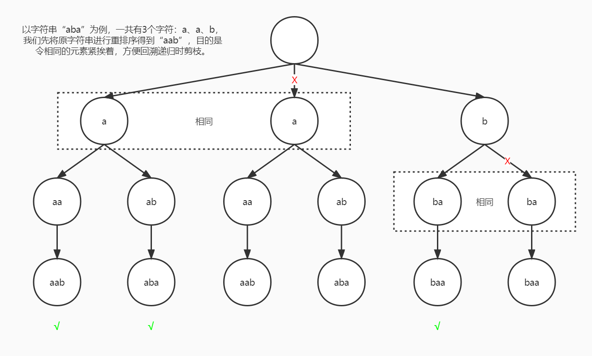

# 面试题38：字符串的排列

> 题目：输入一个字符串，打印出该字符串中字符的所有排列。例如输入字符串abc，则打印出由字符a、b、c所能排列出来的所有字符串abc、acb、bac、bca、cab和cba。

标签：`字符串` `树` `递归`

书中给的方法是不去重的，而牛客和力扣中的题目都是要求去重的。

[牛客](https://www.nowcoder.com/practice/fe6b651b66ae47d7acce78ffdd9a96c7)

[力扣](https://leetcode.cn/problems/zi-fu-chuan-de-pai-lie-lcof/)

## 1 回溯

这道题，类似于一个 n 叉树的深度遍历，每个叶子节点都是一种排列结果，但是有的排列结果是一样的，因此需要去重，即剪枝。

那怎么剪枝呢？不难发现，树的同一层中，节点值相同的，整棵树都是一样的，因此完全可以剪掉这一部分来减少重复递归。但怎么发现同一层内相同的节点呢？我们可以先对字符串进行一个排列，确保相同的字符相邻，然后借助一个辅助数组 visit，



```java
class Solution {
    /**
     * 记录排列结果
     */
    List<String> rec;
    boolean[] vis;

    public String[] permutation(String s) {
        int n = s.length();
        rec = new ArrayList<String>();
        vis = new boolean[n];
        
        // 转数组后，按字典序排序
        char[] arr = s.toCharArray();
        Arrays.sort(arr);
        
        StringBuffer perm = new StringBuffer();
        backtrack(arr, 0, n, perm);
        
        // List to Array
        int size = rec.size();
        String[] recArr = new String[size];
        for (int i = 0; i < size; i++) {
            recArr[i] = rec.get(i);
        }
        return recArr;
    }

    /**
     * 
     */
    private void backtrack(char[] arr, int i, int n, StringBuffer perm) {
        if (i == n) {
            rec.add(perm.toString());
            return;
        }
        for (int j = 0; j < n; j++) {
            if (vis[j] || (j > 0 && !vis[j - 1] && arr[j - 1] == arr[j])) {
                continue;
            }
            vis[j] = true;
            perm.append(arr[j]);
            backtrack(arr, i + 1, n, perm);
            perm.deleteCharAt(perm.length() - 1);
            vis[j] = false;
        }
    }
}
```
